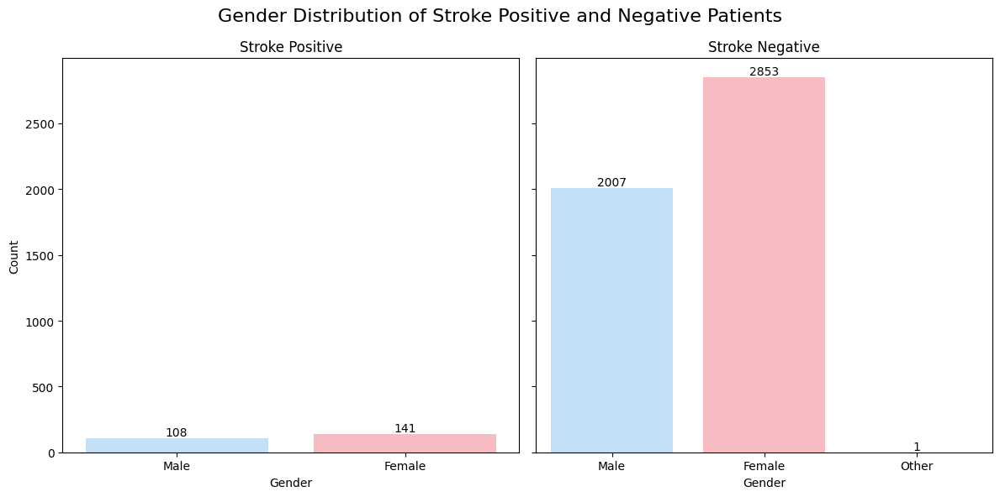
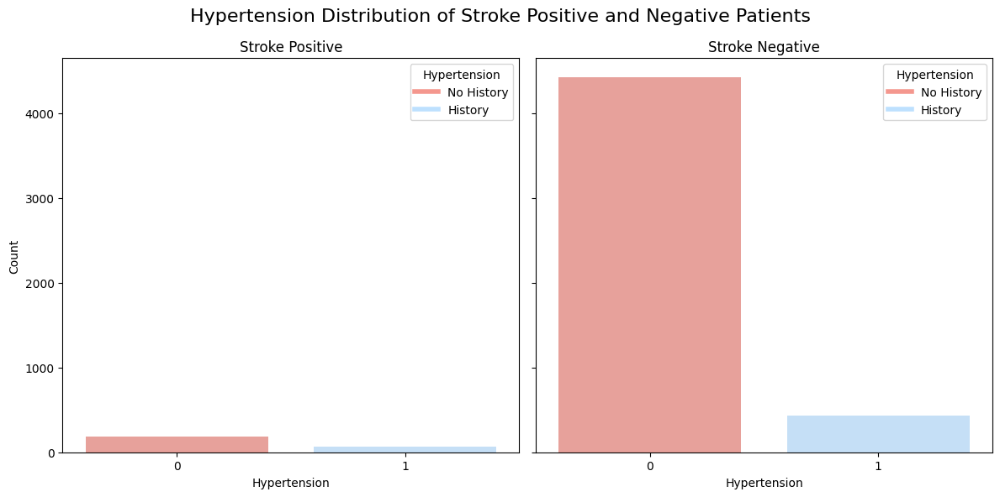
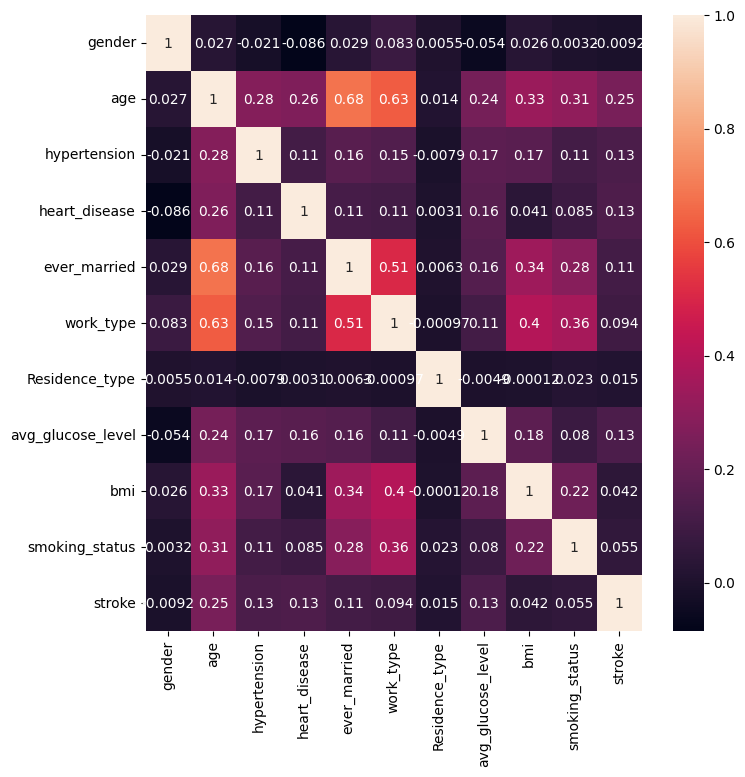
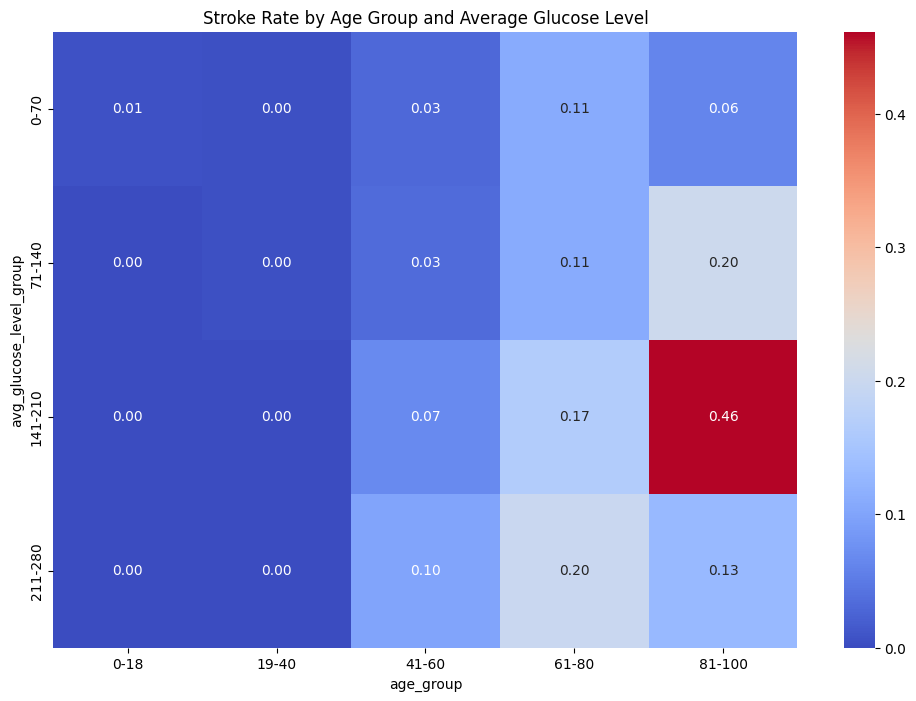
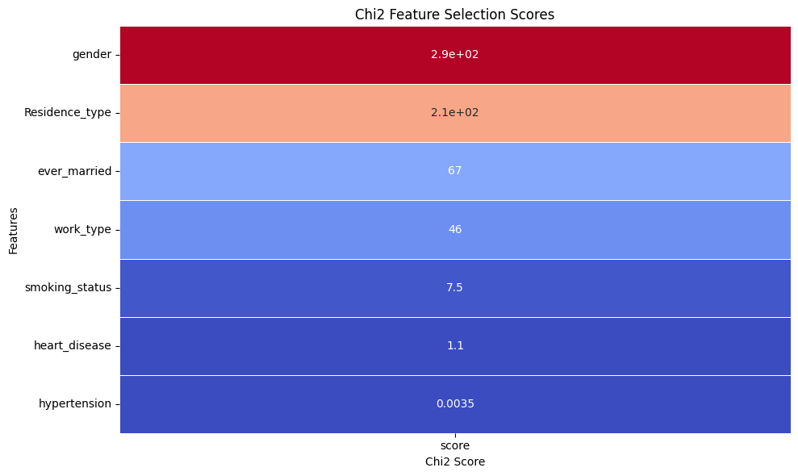
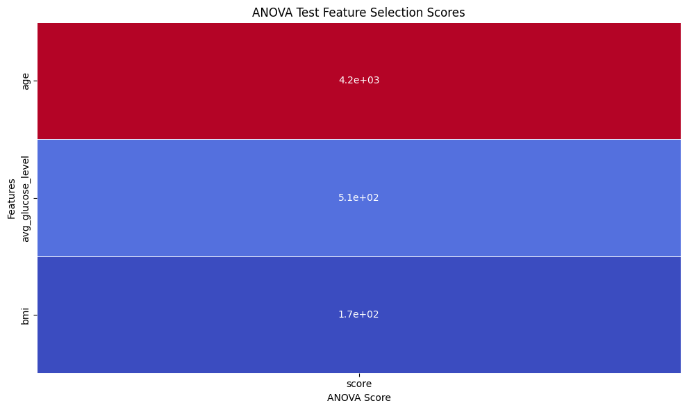
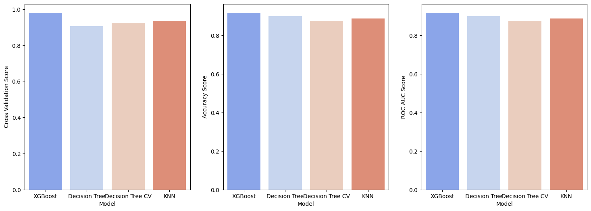

# 🧠 Healthcare Stroke Prediction


# 1. 📌 Description
This is an end-to-end data science project focused on analyzing and predicting stroke risk using patient health indicators. The project utilizes supervised classification techniques to determine whether a person is likely to experience a stroke, based on labeled data.

We structured our workflow following good data science practices:
- Started with **EDA** to explore correlations between stroke and features like age, hypertension, and BMI.
- Cleaned and preprocessed data, handling missing values and encoding categorical variables.
- Built and evaluated multiple machine learning models to identify the best-performing classifier.
- Visualized feature importance to explain the model’s decision process.
- Managed tasks and collaboration using **Jira**.

This project allowed our team to apply a complete data science pipeline using Python, emphasizing practical application, teamwork, and interpretability of results.

# 2. ⚙️Technologies and Tools
- **Python libraries**: Pandas, NumPy, Matplotlib, Seaborn, Scikit-learn, XGBoost
- **Development**: Jupyter Notebook, Git, GitHub, Visual Studio Code
- **Project Management**: Jira

# 3.🎯 Business Problem and Project Objective

## 3.1 What is the problem?
Stroke is a leading cause of death globally. Timely identification of high-risk individuals can help hospitals and healthcare providers take preventive actions and reduce the severity or occurrence of strokes.

## 3.2 What is the context?
Healthcare providers deal with limited resources. They need decision-support tools to efficiently screen patients for stroke risk using demographic and medical data. This can lead to more targeted interventions and cost savings.

## 3.3 Project Objectives
1. Explore and visualize key indicators related to stroke.
2. Build a predictive model that classifies whether a patient is at risk of stroke.
3. Use insights to propose prevention-oriented strategies.

## 3.4 Project Benefits
- Earlier detection of stroke risks.
- Improved patient triage and intervention prioritization.
- Reduced healthcare costs.
- Better resource allocation for at-risk populations.

## 3.5 Conclusion
Our final model achieves strong performance in classifying stroke cases. With interpretability tools like feature importance and SHAP values, it also supports clinicians in understanding model decisions. This project highlights the potential of data science in supporting critical health outcomes.

# 4. Solution Pipeline

1. Define the problem and goals.
2. Understand and explore the dataset.
3. Preprocess data: impute missing values, encode categories, scale numerics.
4. Build models and compare performance.
5. Select the best model and interpret results.
6. Evaluate on unseen data and document findings.
7. Suggest future improvements.


# 5. Key Insights
1. The dataset has the imbalance in stroke feature




2. **Age, hypertension, and BMI** have strong influence on stroke probability.


3. Patients with **heart disease or smoking history** are at higher risk.
- **`Age:`** 0.0689, highly significant (p = 0.000 < 0.001). For each one-year increase in age, the odds of having a stroke increase by approximately 𝑒^0.0689 ≈ 1.071(about a 7.1% increase).

- **`Hypertension:`** 0.3814, significant (p = 0.019 < 0.05). Having hypertension increases the odds of stroke by about 𝑒^0.3814 ≈ 1.464 (a 46.4% increase).

- **`Heart Disease:`** 0.3300, not statistically significant at the 5% level (p = 0.079). This suggests that, in this model, having heart disease is not a strong predictor of stroke, though it might have some effect.

- **`Average Glucose Level:`** 0.0041, highly significant (p = 0.000 < 0.001). For each unit increase in average glucose level, the odds of having a stroke increase by 𝑒^0.0041 ≈ 1.004 (a 0.4% increase).

&rarr; **`Age`** and **`Average Glucose Level`** seem to be strong predictors of stroke based on their significance and effect size.    


4. Visualizations showed clear differences in stroke distribution across age and gender.
- Stroke rates are extremely low for patients under 40 years old, regardless of glucose levels.
- In age groups 61–80 and 81–100, stroke risk increases significantly with higher glucose levels.
- The highest stroke rate (46%) was observed in patients aged 81–100 with glucose levels between 141–210.
- Even within the same age group, higher glucose levels correspond to higher stroke rates — especially evident from the progression of risk in the 41–60 and 61–80 bands.


- Female got higher chance of getting stroke than males.


# 6.🤖 Modelling
## 6.1 🔧 Data Preparation
### Feature Selection:
- Removed unnecessary features (`id`)
#### Statistic:
To assess and rank features quantitatively, we applied two commonly used statistical tests for classification problems:
- **Chi-Square Test (Chi²):**
    - Use case: Categorical features vs. categorical target (stroke).

    - Goal: Measures whether there is a significant relationship between the values of a categorical input and the target label.
    - How it works:

        - Compares observed vs. expected frequencies of feature categories within each class (stroke = 0 or 1).

        - High Chi² value = feature likely impacts stroke prediction.



&rarr; As can be seen, **`hypertension`**, **`heart_disease`** and **`smoking_status`** have really low values, so we will not use them for modelling
- **ANOVA F-test (Analysis of Variance)**
    - **Use case:** Continuous features vs. categorical target (stroke).
    - **Goal:** Identifies features whose mean values differ significantly between stroke and non-stroke groups.
    - **How it works:**

        - Compares the variance between classes to the variance within each class.

        - High F-score = feature is likely to distinguish stroke cases.



&rarr; As can be seen, **`age`** and **`avg_glucose_level`** have really high values, so we will use them for modelling

- Retained medically relevant features:  
  `age`, `hypertension`, `heart_disease`, `avg_glucose_level`, `bmi`, `gender`, `ever_married`, `smoking_status`, `work_type`, `Residence_type`

### Handling Missing Values:
- `bmi`: imputed with **Decision Tree**, because from the ttest we can see that:
    - In terms of numerical columns, since there are statistically significant differences in these features, this strongly suggests that the missingness of bmi is **Missing at Random (MAR)** rather than Missing Completely at Random (MCAR). This means that missing bmi values are likely associated with other variables, such as age, hypertension, heart disease, glucose levels, and stroke occurrence
    - In terms of categorical columns, the missingness of bmi appears to follow a **MAR (Missing at Random)** pattern for certain categorical variables.
    - Also from the heatmap above we can see that **age, hypertension, ever_married and work_type** have the strongest correlation with **bmi**.

- Other features were complete

### Encoding:
- Applied **One-Hot Encoding** to:  
  `gender`, `work_type`, `smoking_status`, `ever_married`, `Residence_type`

### Scaling:
- Applied **StandardScaler** to:  
  `age`, `avg_glucose_level`, `bmi`

### Class Imbalance:
- Applied **SMOTE** to oversample stroke cases in training data

---

## 🧪 6.2. Model Training & Comparison

### Models Tested:
- Decision Tree Classifier  
- KNN
- **XGBoost Classifier ✅ (final model)**

### ⚙️ Training Method:
- 80/20 **train-test split**
- **Stratified K-Fold Cross-Validation** to maintain class balance
- **GridSearchCV** for hyperparameter tuning

---

## 📊 6.3. Evaluation Metrics

- Due to class imbalance, we focused on **Recall** to minimize false negatives.


- The XGBoost has the best performance here with:
    - The high recall for stroke (0.93) indicates that the model is excellent at identifying patients at risk, minimizing false negatives (i.e., high-risk patients missed).

    - The slightly lower precision (0.91) is acceptable in a medical context, where false positives (flagging a healthy patient as at-risk) are less dangerous than false negatives.

    - The confusion matrix shows that out of 970 actual stroke cases, 900 were correctly identified, while only 70 were missed.

    - The XGBoost model generalizes well to unseen data and shows no signs of overfitting thanks to good precision-recall balance across both classes.

---
# 7. Project Structure
.
├── Data/ # Dataset
├── Data_Preprocessing/ # Data cleaning and transformation
├── Data_Exploration/ # EDA notebooks and visualizations
├── Modelling/ # Model building and evaluation
├── Questions/ # Analytical Q&A notebooks
├── Reflection/ # Team learning reflections
├── README.md # This file

---
# 8. Run the project locally

1. Clone the repository:
    ```sh
    git clone https://github.com/truongthuankiet1990gmailcom/StrokePrediction.git
    ```
2. Navigate to the project directory:
    ```sh
    cd StrokePrediction
    ```
3. Choose the appropriate kernel.

## Usage:
- To run the notebooks:
    + Open the notebook in Jupyter and press `Run All`.
    + If there are some libraries not included in your kernel, please run the command prompt and write `pip install required-library`.

---
# 9. Dataset Source
The dataset is publicly available from Kaggle:
📎 https://www.kaggle.com/datasets/fedesoriano/stroke-prediction-dataset

---
# 10. Project Management
🔗 Link to Jira Board:
[Click here to open Jira Board](https://truongthuankiet1990.atlassian.net/jira/software/projects/DSPROG/boards/1/backlog)
